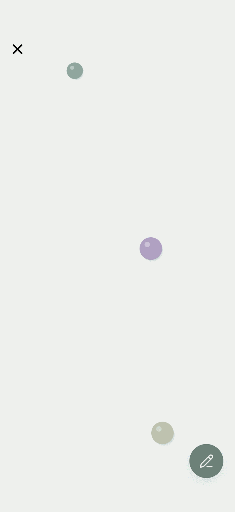
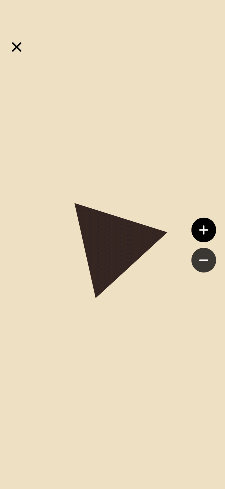

# react-native-skia-lab

react-native-skia-lab is a collection of beautiful demos built with React Native Skia created by <a href="https://x.com/DaehyeonMun" target="_blank" rel="noopener noreferrer">Daehyeon Mun</a>.

## Preview

| Painting | Gesture | Physics |
| --- | --- | --- |
|  |  |  |
| Polygon | Pixel | Shader |
|  |  |  |

## Setup and Run

Follow these steps to set up and run the project on your local machine:

```bash
# Install dependencies
yarn

# Prepare the build environment
yarn prebuild

# Run on Android
yarn android

# OR run on iOS
yarn ios
```
